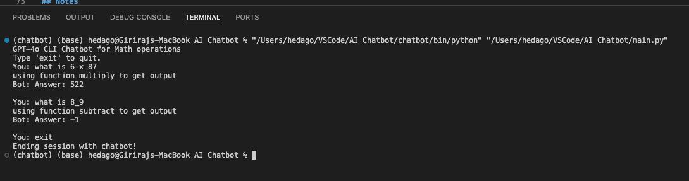

# GPT-4.1 Nano CLI Chatbot with Tool Integration

Welcome to my project illustrating a simple command-line chatbot using OpenAI's GPT-4.1 Nano model that can delegate math operations (add, subtract, multiply, divide) to Python functions as tools.

---

## Features

- Interacts with the GPT-4.1 Nano model
- Routes mathematical queries to specific Python functions
- Modular code structure with tools and main chatbot logic separated
- Uses `.env` file for secure API key management

---

## Setup Instructions

### 1. Clone the repository

```bash
git clone https://github.com/hgiriraj79/AI-Chatbot.git
cd your-repo
```

### 2. Create and activate a virtual environment

```bash
python -m venv your_environment_name
source your_environment_name/bin/activate     # Linux/macOS
.your_environment_name\Scripts\activate       # Windows
```

### 3. Install dependancies

```bash
pip install -r requirements.txt
```

### 4. Configure your OpenAI or Other LLM API key
Create a .env file in the project root with the following content:
```bash
OPENAI_API_KEY = your_llm_api_key_here
```

### 5. Running the chatbot

```bash
python main.py
```

---

## Project Structure
<pre>
project/
├── app/
│   ├── __init__.py
│   ├── tools.py          # mathematical functions: add, subtract, multiply and divide
│   ├── llm.py            # exposing functions defined in tools.py to LLM for generating output
├── main.py               # cli chatbot entrypoint
├── .env                  # OpenAI or other platform API key (not committed to Git)
├── requirements.txt      # dependencies
└── README.md
</pre>

---

## Expected Output 
GPT-4o CLI Chatbot for Math operations
Type 'exit' to quit.
You: what is 20 / 4
Bot: Answer: 5.0
You: multiply 6 and 7
Bot: Answer: 42
You: exit
Goodbye!

## Generated Output


---

## Notes
Make sure you have an active OpenAI API or other platform subscription and enough quota.
The chatbot currently supports simple math operations and can be extended with more tools.